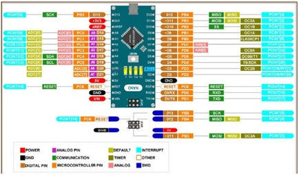

# Quick reference for the Arduino Nano board

## CONFIGURATION OF PINS AND THEIR RESPECTIVE FUNCTIONS




## Delay
Use the `time` module:

```v
import time

time.sleep(2)            // sleep for 2 seconds
time.sleep_ms(50)        // sleep for 50 milliseconds
time.sleep_us(100)       // sleep for 100 microseconds
```

### Functions
name                  | description
----------------------|----------------------
`time.sleep(time)`    | Delay in seconds
`time.sleep_us(time)` | Delay in microseconds
`time.sleep_ms(time)` | Delay in milliseconds


## Internal LEDs
The onboard LED is named `led_0` 

```v
import pin

pin.setup(led_0, pin.output)
pin.high(led_0)
```


## Pins
Use the `pin` module:

```v
import pin

pin.setup(pin.d0, pin.input)
pin.high(pin.d13)
pin.low(pin.d3)
pin.write(pin.d8, pin.read(pin.d0)) // pin echo
```

### Functions
name                    | description
------------------------|--------------------------
`pin.setup(pin, mode)`  | Configure `pin` as `mode`
`pin.high(pin)`         | Turn On `pin`
`pin.low(pin)`          | Turn Off `pin`
`pin.write(pin, value)` | Write `value` in `pin`
`pin.read(pin)`         | Return the state of `pin`


### Digital pin names
The digital pin names are named from `d0` to `d21`.


## Pin ports
Use the `port` module:

```v
import port

port.setup(port.b, port.all_outputs)
port.setup(port.c, port.all_inputs)  // port A bit 7 and 6 as outputs, the rest as inputs

val := port.read(port.c)
port.write(port.b, val) // port echo
```

### Functions
name                      | description
--------------------------|---------------------------
`port.setup(port, mode)`  | Configure `port` as `mode`
`port.read(port)`         | Return the value of `port`
`port.write(port, value)` | Write `value` to `port`

### Digital port names
| Port | Aixt name |
|:----:|:---------:|
| **B**| `b`       |
| **A**| `c`       |
| **B**| `d`       |


## PWM (Pulse Width Modulation)
Use the `pwm` module:

```v
import pwm

pwm.write(pwm.ch0, 40)       // set the duty cycle for PWM channel 0
pwm.write(pwm.ch1, 60)       // set the duty cycle for PWM channel 1
```

### Functions
name                        | description
----------------------------|-----------------------------------
`pwm.write(channel, value)` | Write `value` in the PWM `channel`

### PWM pin names
The PWM channels are named from `ch0` to `ch5`.


## ADC (Analog to Digital Converter)
Use the `adc` module:

```v
import adc

val1 := adc.read(ch0)       // read de ADC channel 0
val2 := adc.read(ch1)       // read de ADC channel 1
```

### Functions
name                | description
--------------------|----------------------------------
`adc.read(channel)` | Return the ADC value in `channel`

### Analog channels
The PWM channels are named from `ch0` to `ch7`.


## UART (serial port)
Use the `uart` module:

```v
import uart

uart.print('Hello ')
uart.println('World...')
```

### Functions
name                    | description
------------------------|---------------------------------------------------------------
`uart.setup(baud_rate)` | Configure the `baud_rate` of the UART
`uart.read()`           | Return one character received by UART
`uart.input(message)`   | Send the `message` and then return the string received by UART
`uart.write(character)` | Send one character by UART
`uart.print(message)`   | Send the `message` by UART
`uart.println(message)` | Send the `message` plus a new line by UART
`uart.any()`            | Return the number uf characters in the UART's buffer
